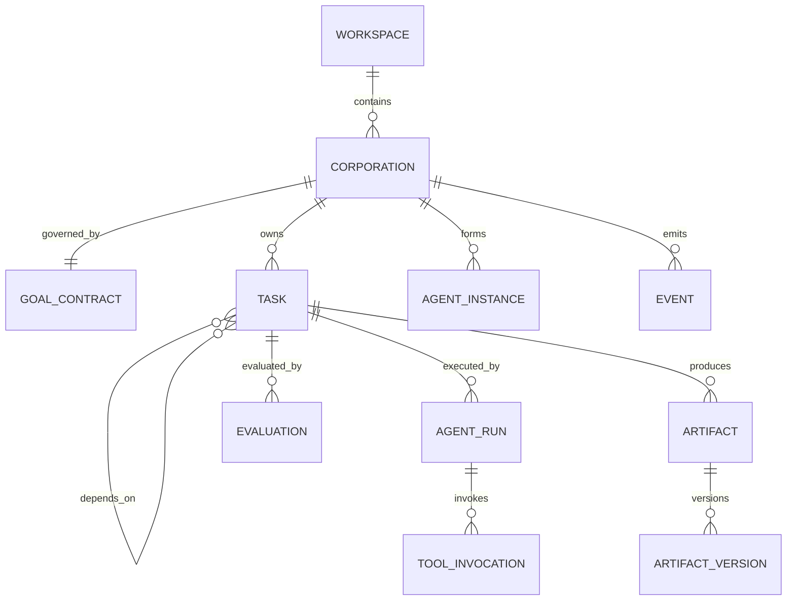

# AI Corporation Desktop v0.1 领域模型与术语

## 1. 设计原则

> **Pi 路线当前模型（2026-08-21）**：当前产品主流程使用 `PiCompany`、`PiEmployee` 和 `PiTask`。下文原 `Corporation`、Goal、Plan、固定组织和 Agent Run 模型只用于旧版历史数据，不再是新任务入口。

- **目标决定组织**：先明确目标与成功条件，再创建角色和任务。
- **任务是基本工作单元**：所有执行必须属于一个 Task。
- **产物承载协作**：Agent 之间通过 Artifact 交接，不靠无限对话。
- **执行与验收分离**：关键产物不能只由生产者自评。
- **自主性受约束**：权限、预算、时间、重试次数和人工审批构成边界。
- **事实优先于模型判断**：能用编译、测试、Schema、哈希验证的，不只用 LLM Judge。

### 1.1 PiCompany

`PiCompany` 是用户长期使用的轻量公司容器，不是一次目标执行实例。

关键关系：

- 一个公司拥有多个任务；
- 一个员工可以加入多家公司，员工的模型和 Skill 配置仍只有一份；
- 一个已授权工作区可以加入多家公司；
- 每项任务固定属于一家公司、一个员工和一个实际工作区；
- 公司首版只提供创建、改名和成员/常用工作区管理，不恢复旧 Goal/Plan 状态机。

已有 Pi 数据升级时归入自动创建的“我的公司”。旧 `Corporation` 保留原身份和历史关系，不与 `PiCompany` 混用 ID，也不改写为新公司。

## 2. 核心实体

### 2.1 旧版 Corporation

一次用户目标的自治执行实例，不是永久公司。该实体只供旧版历史数据和兼容代码使用。

关键字段：

- `id`
- `name`
- `workspace_id`
- `goal_contract_id`
- `status`
- `budget`
- `policy_profile_id`
- `created_at` / `updated_at`

生命周期：

```text
DRAFT → PLANNING → ORGANIZING → EXECUTING → VERIFYING → COMPLETED
                    ↘                    ↘
                     PAUSED / WAITING_HUMAN / FAILED / CANCELLED
COMPLETED / FAILED / CANCELLED → ARCHIVED
```

`ARCHIVED` 是持久化的只读生命周期状态。`PAUSING`、`Start pending` 等仅表示命令尚未完成的 UI 过渡状态，不进入 Corporation 领域状态或 SQLite 枚举。

Milestone 1 的暂停基础允许 `DRAFT` 以及上图中的非终态活动状态进入 `PAUSED`；`PAUSED` 必须持久化暂停来源，继续时只能精确返回该来源状态。该基础不表示 Plan、Task、Run 或 Tool 已存在，也不替代后续未知副作用恢复。

### 2.2 Goal Contract

用户意图的可执行合同，是后续规划与验收的上位依据。

至少包含：

- 原始目标；
- 结构化目标陈述；
- 成功标准；
- 范围内与范围外事项；
- 已知约束与假设；
- 风险等级；
- 交付物清单；
- 预算与停止条件；
- 需要用户澄清的未决问题。

### 2.3 Task

可分配、可执行、可验收、可恢复的最小工作单元。

Task 必须具备：

- 明确目标；
- 输入引用；
- 预期输出类型；
- 验收规则；
- 依赖关系；
- 所需能力；
- 预算；
- 权限需求；
- 完成定义。

### 2.4 Agent Definition 与 Agent Run

- **Agent Definition**：可复用的角色、能力、Prompt 模板、工具集合和模型策略。
- **Agent Run**：某个 Agent Definition 在某个 Task 上的一次执行实例。

Agent 不等于模型：

```text
Agent = Role + Capability + Instructions + Tools + Memory Scope + Policy + Model Strategy
```

### 2.5 Worker

可执行任务的统一抽象。v0.1 支持：

- `llm_agent`
- `tool`
- `human`

未来可扩展：

- 本地模型；
- 外部 Agent；
- 远程服务；
- 脚本工作流。

### 2.6 Artifact

任务执行产生并可被其他任务引用的版本化成果物，例如：

- 文本报告；
- 结构化 JSON；
- 本地文件；
- 代码补丁；
- 测试报告；
- 决策记录；
- 评价报告。

### 2.7 Evaluation

对 Task 或 Artifact 的一次验收记录。它包含验证方法、证据、分数、结论和问题清单。

### 2.8 Capability

对任务要求或 Worker 能力的规范化描述。v0.1 使用分层标签，不建设完整本体：

```text
software.development.typescript
software.testing.unit
research.web
writing.product_requirement
reasoning.planning
```

能力评分不是永久真理，必须带：

- 来源；
- 样本量；
- 适用范围；
- 置信度；
- 最近更新时间。

### 2.9 Event

状态变化的不可变记录，例如：

- `corporation.created`
- `goal.approved`
- `task.ready`
- `agent.run.started`
- `tool.approval.requested`
- `artifact.created`
- `evaluation.completed`

事件用于 UI 更新、恢复、审计和指标，不替代当前状态表。

## 3. 聚合关系



## 4. 统一 ID 与时间

- ID：UUID v7 字符串，便于排序与跨进程传递。
- 时间：数据库存 UTC ISO-8601；UI 按系统时区显示。
- 金额：整数微单位或 Decimal 字符串，禁止二进制浮点记账。
- Token：整数，区分 input、output、cached、reasoning（提供商可用时）。

## 5. 不变量

1. 没有 Goal Contract，不得进入 `EXECUTING`。
2. 没有验收规则的 Task，不得进入 `READY`。
3. Task 依赖未完成时，不得进入 `RUNNING`。
4. `RUNNING` Task 必须有唯一活跃 `Agent Run`；并行候选属于不同 Run。
5. 关键 Task 的生产者不能作为唯一 Judge。
6. 工具权限不得高于 Corporation Policy 和用户授予权限的交集。
7. Artifact 内容不可原地覆盖，只能创建新版本。
8. 每次模型调用必须关联 `corporation_id`、`operation_id` 与规范化 `purpose`；只有执行阶段调用才同时强制关联 `task_id` 和 `run_id`，规划前调用不得伪造 Task/Run。每次工具调用仍必须关联真实 `corporation_id`、`task_id` 和 `run_id`。
9. 终态事件写入后不可删除；敏感内容通过脱敏或密文引用存储。
10. 达到预算、重试或时间上限后必须停止，不得自行扩大边界。
