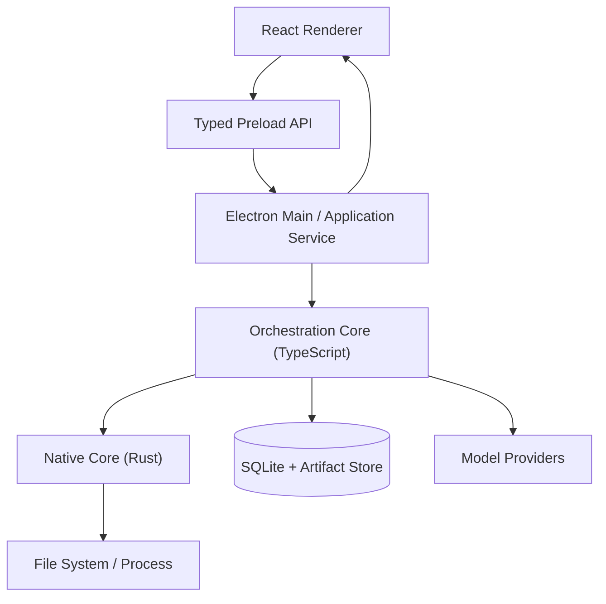
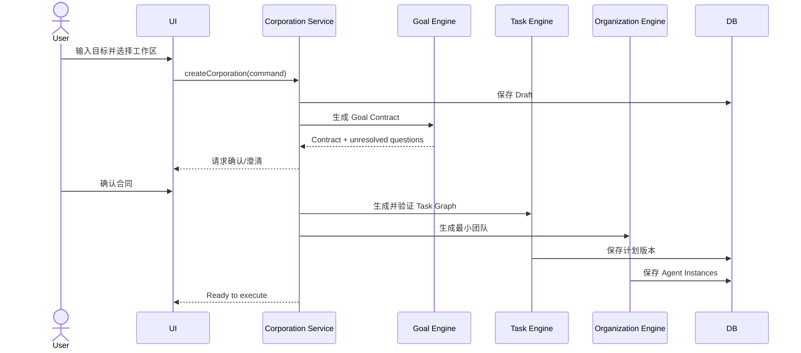
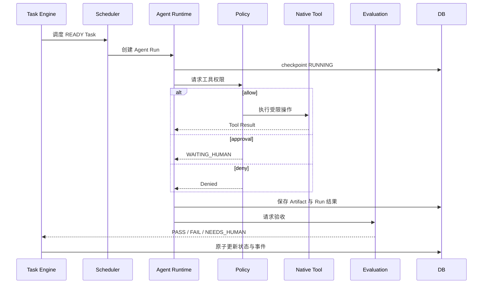

# AI Corporation Desktop v0.1 总体技术设计

| 属性 | 内容 |
|---|---|
| 文档版本 | 1.0 |
| 适用版本 | v0.1 |
| 架构风格 | Local-first、事件驱动、持久化状态机 |
| 主要语言 | TypeScript + Rust |

## 1. 架构目标

构建一个可跨 Windows/macOS 运行、能连续执行多步任务、可观察、可中断、可恢复，并对本地工具调用实施强权限约束的桌面应用。

优先级：

1. 安全边界与状态正确性；
2. 最小闭环可用；
3. 协议稳定和可扩展；
4. 极致性能与复杂分布式能力。

## 2. 关键技术决策

### 2.1 Electron + React

原因：

- 桌面 UI、生态和跨平台成熟；
- TypeScript 适合快速实现编排与 Provider SDK；
- React 适合任务图、时间线和审批界面；
- 可用单一前端代码覆盖 Windows/macOS。

### 2.2 TypeScript 编排 + Rust 系统内核

不采用“所有 Core 一开始全部 Rust”的高成本方案。

职责边界：

| TypeScript | Rust |
|---|---|
| Goal/Organization/Task/Scheduler 业务规则 | 安全路径解析与工作区边界 |
| Agent Runtime 编排 | 子进程启动、终止与资源限制 |
| Provider Adapter 与应用自管 Key Vault | 工作区文件与进程能力 |
| Prompt/Schema/Evaluation 组合 | 原子文件提交、哈希 |
| UI 状态映射 | 后续高性能索引或本地沙箱 |

Rust 通过窄接口暴露能力，不承载 UI 业务语义。未来若编排性能或可靠性需要，可逐步下沉，不影响协议。

### 2.3 SQLite 而非独立数据库

- 单用户、本地优先；
- 易备份、迁移、事务化；
- v0.1 数据规模可控；
- 使用 FTS5 支持文本搜索；
- 语义检索首版可选，不启动 Qdrant/Milvus 等后台服务。

### 2.4 持久化状态 + 事件日志

- 当前状态表支持高效查询；
- append-only 事件表支持审计和 UI 时间线；
- 不做完整 Event Sourcing，避免重放复杂度；
- 关键状态更新与事件插入在同一事务中。

### 2.5 DAG 而非自由 Agent Chat

任务依赖、输入、输出和验收显式化。协作通过 Artifact 引用完成。有限的 Agent 交互发生在 Task 内部，不形成无限会议。

## 3. 逻辑架构



### 3.1 Renderer

只负责展示和用户意图采集。不得直接：

- 访问 Node.js；
- 未经用户明确查看动作读取 API Key；
- 操作文件系统；
- 执行命令；
- 直接调用模型网络 API。

Renderer 的页面、导航、交互状态、安全审批和组件实现必须遵守 [UI/UX 文档中心](../07-ui/README.md)，并由领域状态与脱敏事件驱动，不得自行推断任务完成、权限或副作用状态。

### 3.2 Preload Bridge

暴露少量、版本化、带 Schema 的命令：

- Corporation 查询与命令；
- 审批响应；
- Provider 配置；
- 文件选择；
- 事件订阅。

禁止暴露通用 `ipc.invoke(channel, payload)` 给页面。

### 3.3 Electron Main / Application Service

- 进程生命周期；
- 命令路由；
- 窗口与深链接；
- 编排服务启动/停止；
- IPC 鉴权与参数验证；
- 自动更新；
- 处理系统休眠和退出。

### 3.4 Orchestration Core

模块：

- Goal Engine
- Organization Engine
- Task Engine
- Scheduler
- Agent Runtime
- Evaluation Engine
- Artifact Service
- Policy Service
- Budget Service
- Event Service
- Recovery Service

### 3.5 Native Core

以 sidecar 可执行程序或 Node-API 扩展实现。v0.1 推荐 **sidecar + 长连接 JSON-RPC**，理由是崩溃隔离和更清晰的权限边界。

能力：

- canonical path 与工作区约束；
- 原子读写；
- 文件哈希与乐观锁；
- 子进程执行、输出流和取消；
- 平台差异适配。

Provider Key Vault 与 Provider 网络请求属于 TypeScript Application/Infrastructure，不进入 Native Core。

### 3.6 Storage

```text
Application Data/
├── app.db
├── artifacts/
│   └── <corporation-id>/<artifact-id>/<version>/...
├── logs/
└── backups/

User Workspace/
└── 用户授权的实际交付文件
```

内部 Artifact Store 与用户工作区分离。对工作区的修改通过变更集和原子提交完成。

## 4. 建议仓库结构

```text
ai-corporation/
├── apps/
│   └── desktop/
│       ├── src/main/
│       ├── src/preload/
│       └── src/renderer/
├── packages/
│   ├── domain/
│   ├── orchestration/
│   ├── protocols/
│   ├── providers/
│   ├── tools/
│   ├── storage/
│   └── ui/
├── crates/
│   ├── native-core/
│   ├── workspace-fs/
│   └── process-runner/
├── schemas/
├── migrations/
├── docs/
└── tests/
    ├── fixtures/
    ├── integration/
    └── e2e/
```

## 5. 核心运行流程

### 5.1 创建与规划



### 5.2 Task 执行



## 6. 一致性与事务边界

必须在同一事务中完成：

- 状态迁移 + 对应事件；
- Task 领取 + Agent Run 创建；
- Artifact 元数据 + Artifact Version；
- Evaluation 结论 + Task 后续状态；
- Budget Ledger + 已用预算汇总。

文件内容写入流程：

1. 写临时文件；
2. `fsync`（平台允许时）；
3. 计算哈希；
4. 原子重命名到 Artifact Store；
5. SQLite 事务登记版本；
6. 需要提交到用户工作区时，验证基线哈希并原子替换。

数据库不得保存大段二进制内容。小型结构化 JSON 可直接保存。

## 7. 并发模型

- 一个应用级 Orchestrator；
- Corporation 可并存，但 v0.1 默认只运行一个；
- 每个 Corporation 默认最多 2 个活跃 Task；
- 每个 Task 只有一个负责提交结果的活跃 Run；
- Provider 使用全局/每 Provider 并发限流；
- SQLite 使用单写队列，读连接池；
- 所有可取消操作接收 `AbortSignal` 或等价取消令牌。

调度领取使用条件更新避免重复执行：

```sql
UPDATE task
SET status = 'RUNNING', lease_owner = ?, lease_expires_at = ?
WHERE id = ? AND status = 'READY';
```

受影响行数为 1 才获得执行权。

## 8. 恢复模型

### 8.1 检查点

在以下边界保存：

- 模型调用前后；
- 工具调用前后；
- Artifact 提交后；
- Evaluation 后；
- 状态迁移时。

### 8.2 重启恢复

1. 扫描 `RUNNING` 且租约过期的 Task/Run；
2. 若上一步是纯模型读取，可安全重试；
3. 若工具调用有 idempotency key 且已记录完成，复用结果；
4. 若副作用状态不确定，标记 `WAITING_HUMAN`；
5. 生成 `recovery.detected` 事件；
6. 用户确认或系统从安全检查点继续。

## 9. 版本化协议

所有跨模块 DTO 包含：

```json
{
  "schemaVersion": "1.0",
  "id": "019...",
  "createdAt": "2026-07-27T08:00:00Z"
}
```

兼容规则：

- 同一 major 内允许新增可选字段；
- 不允许改变字段语义；
- major 变化需迁移器；
- 未知枚举值按 `UNKNOWN` 处理并保留原值。

## 10. 安全架构摘要

防护面：

- 用户输入与外部文件均为不可信内容；
- 模型输出不是命令授权；
- 工具调用必须经过 Policy Engine；
- 路径必须由 Native Core canonicalize 后校验；
- 命令使用参数数组，不拼接 shell 字符串；
- API Key 由 Main/Application Service 使用应用本地加密密钥加解密；完整 Key 只以密文进入 SQLite，不进入 Native Core 或 OS 安全存储；
- Renderer 只能通过专用 typed IPC 录入、替换、删除 Key，并在用户主动点击“显示”后取得明文；列表、事件、日志、错误和普通 Provider DTO 不得携带明文；
- Renderer 的内容安全策略禁止任意远程脚本；
- 日志、事件和错误在落盘前脱敏；
- 更新包必须签名。

详细设计见 [Electron、TypeScript 与 Rust 工程架构](../05-infrastructure/Desktop-and-Rust-Architecture.md)、[Tool Runtime](../05-infrastructure/Tool-Runtime.md) 和 [Policy Engine](../05-infrastructure/Policy-Engine.md)。

## 11. 模型与工具可扩展点

### ModelProvider

- `listModels`
- `validateConfig`
- `generate`
- `stream`
- `cancel`
- `normalizeUsage`

### Tool

- `descriptor`
- `validateInput`
- `assessRisk`
- `execute`
- `cancel`
- `summarizeResult`

### Evaluator

- `supports(criteria, artifactType)`
- `evaluate`
- `explainEvidence`

扩展点必须返回结构化错误，不得向上层泄漏厂商专属异常。

## 12. 开发环境与构建

- Node.js LTS；
- pnpm workspace；
- TypeScript strict；
- Rust stable；
- Vitest；
- Playwright Electron；
- SQL migrations；
- GitHub Actions 或等价 CI 分别构建 Windows/macOS；
- electron-builder 生成安装包；
- macOS notarization 与 Windows code signing 在正式发布前启用。

实际版本在项目初始化时锁定到当时的维护版本，不在设计文档中写死易过期的小版本号。

## 13. 架构风险与缓解

| 风险 | 影响 | 缓解 |
|---|---|---|
| Electron 与 Rust 双运行时增加复杂度 | 构建和调试成本 | 保持窄 RPC；Rust 只承载明确能力 |
| LLM 输出不稳定 | 计划或协议失败 | JSON Schema、修复一次、回退与人工确认 |
| 工具副作用重复 | 数据损坏 | 幂等键、检查点、原子提交、未知状态人工介入 |
| Judge 偏差 | 错误通过或循环修订 | 确定性验证优先、证据化、修订上限 |
| 上下文膨胀 | 成本与质量下降 | Artifact 引用、摘要、按需检索、Token 预算 |
| Provider 差异 | 兼容层失真 | 原生适配器 + 统一最小能力模型 |
| 跨平台命令差异 | 任务不一致 | Tool 抽象、平台适配、避免让模型直接写 shell |

## 14. v0.1 架构验收

- Renderer 无 Node 权限；Key 输入与回显默认遮挡，只有用户主动选择查看时才通过 typed IPC 读取明文，明文查看状态不得持久化；
- 一条完整任务链可在数据库和时间线中追踪；
- 状态与事件事务一致；
- 任务重启恢复不重复文件写入；
- Provider、Tool、Evaluator 至少各有一个替代实现或测试桩；
- 工作区越界路径测试全部被拒绝；
- Windows/macOS 共享同一业务代码和 Schema；
- 产品 PRD 中 AC-01 至 AC-04 全部通过。
