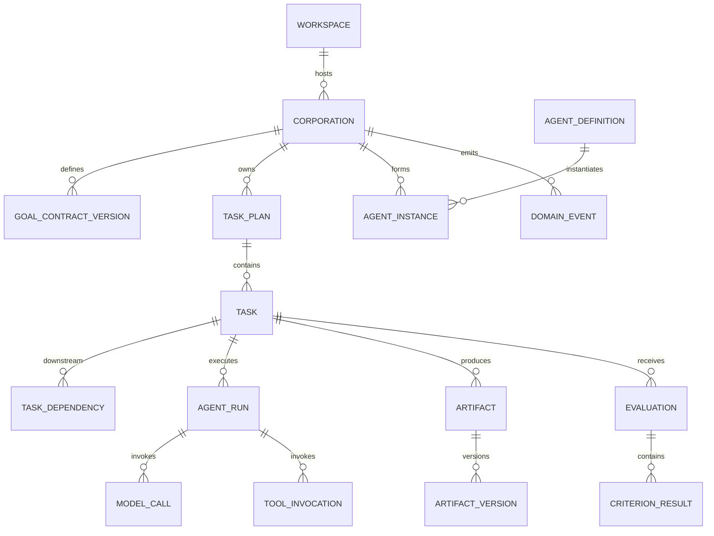

# 数据模型设计

## 1. 目标

本文件把领域模型映射为持久化实体，说明关系、所有权、不可变性和删除策略。具体 DDL 见 [SQLite Schema](SQLite-Schema.md)。

## 2. 聚合

### 2.1 Pi 路线当前映射

| 聚合 | 逻辑实体 | 物理映射 |
| --- | --- | --- |
| Pi Company | `pi_company` | `pi_company` 表；长期轻量公司名称和时间 |
| Pi Company | 员工成员关系 | `pi_company_employee` 表；同一员工可加入多家公司 |
| Pi Company | 常用工作区关系 | `pi_company_workspace` 表；不复制或改变 Workspace 授权 |
| Pi Employee | `pi_employee` | `pi_employee` 表；全局唯一模型和 Skill 配置 |
| Pi Task | `pi_task` | `pi_task.company_id` 固定归属一家公司，同时保留员工和实际工作区引用 |
| Legacy | 旧 `corporation` 及 Goal/Plan/Organization/Run | 原表保留但当前界面不提供入口，不迁移为 `pi_company` |

升级已有 Pi 数据时，迁移只在存在 Pi 员工或任务时创建“我的公司”，把全部现有 Pi 员工、任务和任务引用过的工作区接入。迁移不改变原 Task ID、Employee ID、Workspace ID、事件、工具调用、命令调用、状态或时间，也不产生模型和工具副作用。

### 2.2 旧路线映射

本节中的名称是逻辑实体，不等同于“一实体一张表”。每个逻辑实体必须明确映射到独立表、父表结构化字段、账本/事件投影或受管 Artifact；禁止由实现者临时选择存储位置。

| 聚合        | 逻辑实体                       | v0.1 物理映射                                                                                                         |
| ----------- | ------------------------------ | --------------------------------------------------------------------------------------------------------------------- |
| Workspace   | `workspace`                    | `workspace` 表                                                                                                        |
| Workspace   | `workspace_permission`         | `workspace.permission_mode`、`access_status`、`last_verified_at`                                                      |
| Workspace   | `workspace_snapshot`           | `workspace.path_identity_json`；只保存平台身份校验的最小元数据                                                        |
| Corporation | `corporation`                  | `corporation` 表                                                                                                      |
| Corporation | `goal_contract`                | `0004` 增加 `corporation.active_goal_version` 并通过 trigger 指向本 Corporation 的当前 DRAFT，不设可变主表            |
| Corporation | `goal_contract_version`        | `goal_contract_version` 表，不可变                                                                                    |
| Corporation | `goal_generation_operation`    | `goal_generation_operation` 表；保存有界澄清、周期、严格草稿、问题、答案和聚合 usage，不保存原始模型正文              |
| Corporation | `corporation_policy`           | v0.1 使用内置、版本化 Policy Bundle；后续迁移增加 `corporation.policy_version`                                        |
| Corporation | `organization`                 | `corporation.active_organization_version` 指向已激活版本；未激活时为空                                                |
| Corporation | `organization_version`         | `organization_version` 表；草案正文不可变，生命周期只允许当前 `DRAFT` 原子转为 `APPROVED`                             |
| Corporation | `organization_activation`      | `organization_activation` 表；保存三组角色模型路由快照、可降级缺口接受事实和幂等回执引用，不保存 Key                  |
| Corporation | 命令幂等回执                   | 内部 `corporation_command` 与 `goal_contract_command` 表；Renderer 不可读取                                           |
| Task        | `task_plan`                    | `task_plan` 表；保存 Planner 草稿、语义草稿 hash、受限验证报告、版本取代关系、批准时间与 `PENDING/VALID/INVALID` 事实 |
| Task        | `planner_generation_operation` | `planner_generation_operation` 表；保存生成检查点、版本绑定、聚合 usage 和中断状态，不保存模型正文                    |
| Task        | `task`                         | `task` 表；只有 Plan 验证通过后在同一事务中从可信 Task ID 映射物化                                                    |
| Task        | `task_dependency`              | `task_dependency` 表；只保存同一 Plan 内已验证的可信 Task UUID 边                                                     |
| Task        | `task_input`                   | `task.contract_json.inputRefs`                                                                                        |
| Task        | `task_output_contract`         | `task.contract_json.expectedOutputs`                                                                                  |
| Task        | `acceptance_criterion`         | `task.contract_json.acceptanceCriteria`                                                                               |
| Task        | `task_lease`                   | `task.lease_owner`、`lease_expires_at`                                                                                |
| Agent       | `agent_definition`             | `agent_definition` 表；能力和策略在版本化 `definition_json`                                                           |
| Agent       | `agent_instance`               | `agent_instance` 表；团队激活时从当前草案模板原子创建，保存 Definition、工具与模型路由快照                            |
| Agent       | `agent_capability`             | `agent_definition.definition_json.capabilities`                                                                       |
| Agent       | `agent_run`                    | `agent_run` 表；执行尝试、状态、检查点和汇总 usage                                                                    |
| Agent       | `agent_run_candidate`          | `agent_run_candidate` 表；M3-TU-04 的模型候选正文与软件生成引用，不是正式 Artifact                                    |
| Agent       | `agent_run_command`            | `agent_run_command` 表；继续、重试和取消命令的幂等回执                                                                |
| Agent       | `model_call`                   | `model_call` 表；所有调用关联 Corporation/operation/purpose，执行阶段 purpose 另外要求真实 Task/Run                   |
| Agent       | `tool_invocation`              | `tool_invocation` 表                                                                                                  |
| Artifact    | `artifact`                     | `artifact` 表                                                                                                         |
| Artifact    | `artifact_version`             | `artifact_version` 表，不可变                                                                                         |
| Artifact    | `artifact_source`              | `artifact_source` 表                                                                                                  |
| Artifact    | `change_set`                   | `artifact` 中 `CHANGE_SET` 类型及其当前 `artifact_version`                                                            |
| Artifact    | `change_set_operation`         | Change Set 的版本化内容，按 Artifact Protocol Schema 存储                                                             |
| Evaluation  | `evaluation_plan`              | `task.contract_json.acceptanceCriteria` 与运行时选择的 evaluator 列表                                                 |
| Evaluation  | `evaluation`                   | `evaluation` 表                                                                                                       |
| Evaluation  | `criterion_result`             | `evaluation.report_json.criterionResults`                                                                             |
| Evaluation  | `evidence_ref`                 | `evaluation.report_json.evidenceRefs`，引用 Artifact/Run/Tool 记录                                                    |
| Evaluation  | `evaluation_issue`             | `evaluation.report_json.issues`                                                                                       |
| Governance  | `approval_request`             | `approval_request` 表                                                                                                 |
| Governance  | `budget_account`               | `budget_ledger` 的 Corporation 级投影                                                                                 |
| Governance  | `budget_reservation`           | `budget_ledger` 中成对的 `RESERVE`/`RELEASE` 条目                                                                     |
| Governance  | `budget_ledger`                | `budget_ledger` 表，只追加                                                                                            |
| Governance  | `policy_decision`              | `domain_event` 中版本化 Policy Decision 事件                                                                          |
| Governance  | `domain_event`                 | `domain_event` 表，只追加                                                                                             |
| Governance  | `decision_record`              | `DECISION_RECORD` Artifact                                                                                            |
| Governance  | `provider`                     | `provider` 表                                                                                                         |
| Governance  | `model_route`                  | Agent Definition/Instance 的版本化路由引用与运行时调度记录                                                            |
| Governance  | `memory_item`                  | `memory_item` 表                                                                                                      |
| Governance  | `capability_outcome`           | Evaluation、Agent Run 与用量记录形成的可重建投影                                                                      |

Workspace 路径是敏感数据。Renderer 只获得用户主动授权的 `display_path`、Workspace ID、权限和可访问状态；`canonical_root_path` 与 `path_identity_json` 只存在于 Electron Main、Rust Core 和持久化层。

Task 身份在一个 Plan 版本内稳定；每次计划修订创建新的 Plan UUID 和全套新 Task UUID，并保留旧版本只读，禁止改写历史合同。已批准 Plan 冻结，重新规划由后续独立任务创建新版本。Agent Definition 可复用，Instance 属于 Corporation，Run 属于 Task。Artifact Version 不可变；文件内容位于 Artifact Store，数据库保存引用和哈希。

## 3. 核心关系



## 4. 状态存储

枚举在应用层验证，SQLite 使用 TEXT + CHECK 约束。原因：

- 可读；
- 迁移简单；
- 不依赖数据库厂商枚举；
- 未知值可在迁移时明确处理。

状态表保存当前值，`domain_event` 保存变化历史。

Corporation 的 create、update-name 与 archive 在同一个 `BEGIN IMMEDIATE` 短事务中提交当前状态、一个同版本 Domain Event 和一个命令回执。Goal save/approve 同样原子提交 Corporation version/active pointer、不可变 Goal 版本或元数据、一个同 Corporation version Domain Event 和 Goal 命令回执。pause/resume 原子提交 Corporation 状态、`paused_from`/`paused_at`、同版本 Domain Event 和独立 `corporation_state_command` 回执；resume 目标只取持久化 `paused_from`。`domain_event` 与 Goal 内容由 SQLite trigger 拒绝未授权更新或删除；未来事件分发游标使用独立投影，不修改事实事件。

Goal Engine 在网络调用前短事务写入 operation/model-call 检查点，网络调用在事务外；结果仅在 Corporation、Goal、Provider 和 operation 版本仍匹配时条件写入。最终 `PROVIDER` Goal 保存与 Goal Contract 版本事务合并，操作状态只在 Goal 事务成功后变为 `GOAL_SAVED`。重启时遗留 `GENERATING` 转为 `INTERRUPTED`，不自动重放。

Planner 保存 `DRAFT/PENDING` 后由本地验证器处理。验证失败只提交受限 report 与 `DRAFT/INVALID`，不得留下正式 Task；验证通过在同一短事务中写入 Task、依赖、report 与 `VALIDATED/VALID`。应用启动只重试仍为 `PENDING` 的本地验证，不调用 Provider；相同语义草稿 hash 和 validator version 不重复物化。

## 5. JSON 使用边界

适合 JSON：

- Provider 专属非查询配置；
- 模型用量明细；
- Policy 输入快照；
- 结构化诊断详情；
- Schema 化的小型 Artifact。

不适合 JSON：

- Task 状态；
- 依赖边；
- 常用筛选字段；
- 成本账本；
- 需要外键完整性的关系。

每个 JSON 字段带对应 Schema 版本。

## 6. 删除与保留

### 6.1 软删除

以下实体使用 `archived_at` 或 `retired_at`：

- Corporation；
- Agent Definition；
- Provider 配置；
- Memory Item。

### 6.2 不可删除审计记录

在 Corporation 存在期间不删除：

- Domain Event；
- Budget Ledger；
- Approval；
- Evaluation；
- Tool Invocation；
- Artifact 来源。

### 6.3 用户发起彻底删除

流程：

1. 停止运行；
2. 生成删除预览；
3. 删除内部 Artifact 与数据库记录；
4. 删除密钥引用（如不再使用）；
5. 默认不删除用户工作区文件；
6. vacuum 由维护任务择机执行；
7. 输出删除报告。

## 7. 敏感数据分类

| 数据                   | 存储                                                                                                                                                        |
| ---------------------- | ----------------------------------------------------------------------------------------------------------------------------------------------------------- |
| API Key / Token        | AI Corporation Desktop 应用自管 Key Vault；SQLite 只保存认证加密后的密文、nonce、认证标签和加密版本                                                         |
| Key Vault 本地加密密钥 | 应用数据目录中的应用自管文件；不进入 SQLite、OS Keychain/Credential Manager 或 Native Core                                                                  |
| Provider Endpoint      | SQLite                                                                                                                                                      |
| Provider 连接测试      | SQLite；仅保存配置版本、标准状态/错误、测试时间和受限模型列表，不保存原始响应、Authorization 或 Key                                                         |
| Provider 生成配置      | SQLite；保存显式 API dialect、精确选择的模型 ID 和 5–300 秒生成超时，不保存 Key                                                                             |
| Provider 生成测试      | SQLite；仅保存当前配置版本、标准状态/错误、受限输出预览、stop reason、标准 usage 和时间，不保存输入、原始请求/响应、Authorization 或 Key                    |
| Goal Engine 操作       | SQLite；保存用户 Goal 字段、严格草稿、结构化问题/答案、周期/轮次、标准失败与聚合 usage；不保存 Workspace 路径/文件、system prompt、原始请求/响应或非法 JSON |
| 模型调用记录           | SQLite；保存 Corporation/operation/purpose、Provider/模型版本、attempt、状态、标准 usage 与时间；不保存输入/输出正文或远端 request ID                       |
| 完整 Prompt/响应       | 默认不长期保存；调试模式脱敏                                                                                                                                |
| 文件绝对路径           | SQLite，可视为敏感                                                                                                                                          |
| Artifact 内容          | Managed Store / Workspace                                                                                                                                   |
| 费用与 Token           | SQLite                                                                                                                                                      |
| 审批理由               | SQLite，脱敏                                                                                                                                                |

## 8. ID、金额与时间

- ID：UUID v7 TEXT；
- 金额：微单位 decimal string 在协议中，SQLite INTEGER（确保范围）；
- Token：INTEGER；
- 时间：UTC ISO-8601 TEXT；
- 排序：时间 + UUID；
- 哈希：小写十六进制 SHA-256。

## 9. 乐观并发

核心可变表包含 `version INTEGER NOT NULL`：

```sql
UPDATE task
SET status = ?, version = version + 1
WHERE id = ? AND version = ?;
```

影响行数为 0 表示并发冲突，调用方重新加载。

## 10. 索引策略

关键查询：

- Corporation 列表和状态；
- Ready Task；
- Task 依赖；
- Run/Tool/Model 调用时间线；
- Artifact 当前版本；
- 待审批；
- 未投递事件；
- Budget 余额；
- Memory FTS。

索引以真实查询验证，避免为所有字段盲目建索引。

## 11. 迁移原则

- 迁移顺序单调；
- 应用启动前备份；
- 每次迁移在事务中执行（SQLite 支持范围内）；
- 大表重建使用新表复制切换；
- 不允许应用自动降级数据库；
- 新版本首次打开后记录 schema version；
- 迁移测试覆盖从所有已发布版本升级。

## 12. v0.1 模块验收断言

- 所有核心实体有明确所有权；
- 外键、唯一性和状态约束落地；
- 账本与事件不可被普通业务更新；
- 完整明文密钥不进入数据库；Key Vault 密文及其非秘密加密元数据可以进入 SQLite；
- 数据删除、备份和迁移行为有测试。
