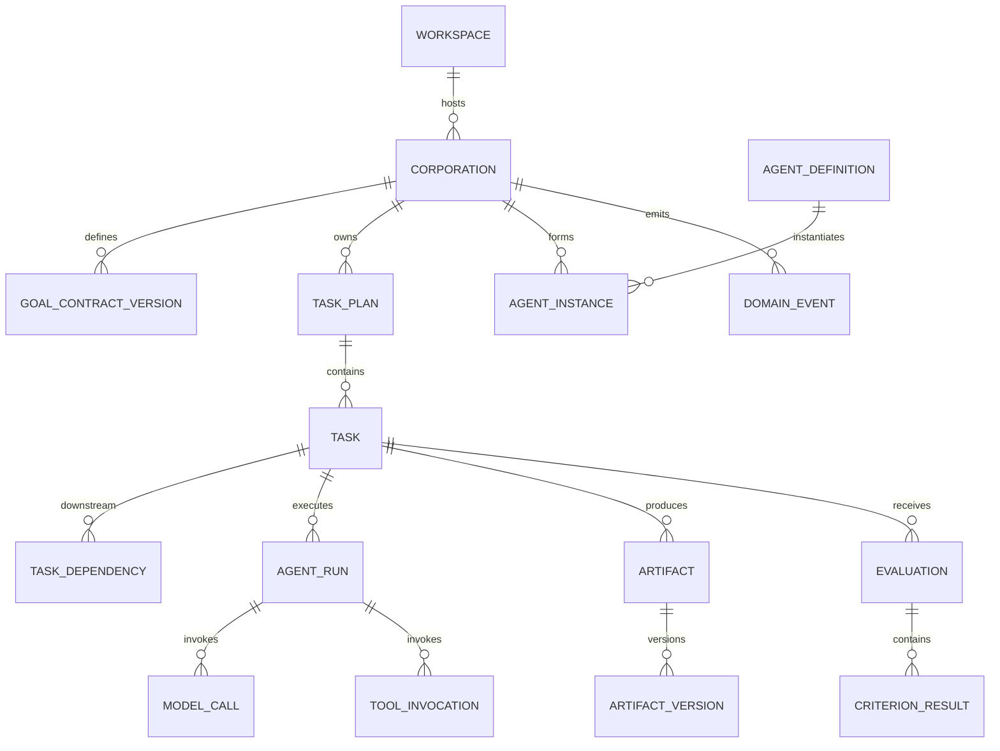

# 数据模型设计

## 1. 目标

本文件把领域模型映射为持久化实体，说明关系、所有权、不可变性和删除策略。具体 DDL 见 [SQLite Schema](SQLite-Schema.md)。

## 2. 聚合

### 2.1 Workspace 聚合

- `workspace`
- `workspace_permission`
- `workspace_snapshot`

Workspace 保存用户授权根目录和平台标识。路径是敏感数据，展示和日志需最小化。

### 2.2 Corporation 聚合

- `corporation`
- `goal_contract`
- `goal_contract_version`
- `corporation_policy`
- `organization`
- `organization_version`

Corporation 是顶级业务所有者。其状态变更必须版本化。

### 2.3 Task 聚合

- `task_plan`
- `task`
- `task_dependency`
- `task_input`
- `task_output_contract`
- `acceptance_criterion`
- `task_lease`

Task 使用稳定 ID；计划修订可创建新 Task 或标记旧 Task 被取代，禁止改变已执行 Task 的历史合同。

### 2.4 Agent 聚合

- `agent_definition`
- `agent_instance`
- `agent_capability`
- `agent_run`
- `model_call`
- `tool_invocation`

Definition 可复用；Instance 属于 Corporation；Run 属于 Task。

### 2.5 Artifact 聚合

- `artifact`
- `artifact_version`
- `artifact_source`
- `change_set`
- `change_set_operation`

Version 不可变。文件内容在 Artifact Store，数据库保存引用。

### 2.6 Evaluation 聚合

- `evaluation_plan`
- `evaluation`
- `criterion_result`
- `evidence_ref`
- `evaluation_issue`

### 2.7 Governance 与运营

- `approval_request`
- `budget_account`
- `budget_reservation`
- `budget_ledger`
- `policy_decision`
- `domain_event`
- `decision_record`
- `provider`
- `model_route`
- `memory_item`
- `capability_outcome`

## 3. 核心关系



## 4. 状态存储

枚举在应用层验证，SQLite 使用 TEXT + CHECK 约束。原因：

- 可读；
- 迁移简单；
- 不依赖数据库厂商枚举；
- 未知值可在迁移时明确处理。

状态表保存当前值，`domain_event` 保存变化历史。

## 5. JSON 使用边界

适合 JSON：

- Provider 专属非查询配置；
- 模型用量明细；
- Policy 输入快照；
- 结构化诊断详情；
- Schema 化的小型 Artifact。

不适合 JSON：

- Task 状态；
- 依赖边；
- 常用筛选字段；
- 成本账本；
- 需要外键完整性的关系。

每个 JSON 字段带对应 Schema 版本。

## 6. 删除与保留

### 6.1 软删除

以下实体使用 `archived_at` 或 `retired_at`：

- Corporation；
- Agent Definition；
- Provider 配置；
- Memory Item。

### 6.2 不可删除审计记录

在 Corporation 存在期间不删除：

- Domain Event；
- Budget Ledger；
- Approval；
- Evaluation；
- Tool Invocation；
- Artifact 来源。

### 6.3 用户发起彻底删除

流程：

1. 停止运行；
2. 生成删除预览；
3. 删除内部 Artifact 与数据库记录；
4. 删除密钥引用（如不再使用）；
5. 默认不删除用户工作区文件；
6. vacuum 由维护任务择机执行；
7. 输出删除报告。

## 7. 敏感数据分类

| 数据 | 存储 |
|---|---|
| API Key / Token | OS 安全存储，只存引用 |
| Provider Endpoint | SQLite |
| 完整 Prompt/响应 | 默认不长期保存；调试模式脱敏 |
| 文件绝对路径 | SQLite，可视为敏感 |
| Artifact 内容 | Managed Store / Workspace |
| 费用与 Token | SQLite |
| 审批理由 | SQLite，脱敏 |

## 8. ID、金额与时间

- ID：UUID v7 TEXT；
- 金额：微单位 decimal string 在协议中，SQLite INTEGER（确保范围）；
- Token：INTEGER；
- 时间：UTC ISO-8601 TEXT；
- 排序：时间 + UUID；
- 哈希：小写十六进制 SHA-256。

## 9. 乐观并发

核心可变表包含 `version INTEGER NOT NULL`：

```sql
UPDATE task
SET status = ?, version = version + 1
WHERE id = ? AND version = ?;
```

影响行数为 0 表示并发冲突，调用方重新加载。

## 10. 索引策略

关键查询：

- Corporation 列表和状态；
- Ready Task；
- Task 依赖；
- Run/Tool/Model 调用时间线；
- Artifact 当前版本；
- 待审批；
- 未投递事件；
- Budget 余额；
- Memory FTS。

索引以真实查询验证，避免为所有字段盲目建索引。

## 11. 迁移原则

- 迁移顺序单调；
- 应用启动前备份；
- 每次迁移在事务中执行（SQLite 支持范围内）；
- 大表重建使用新表复制切换；
- 不允许应用自动降级数据库；
- 新版本首次打开后记录 schema version；
- 迁移测试覆盖从所有已发布版本升级。

## 12. v0.1 完成标准

- 所有核心实体有明确所有权；
- 外键、唯一性和状态约束落地；
- 账本与事件不可被普通业务更新；
- 密钥不进入数据库；
- 数据删除、备份和迁移行为有测试。

