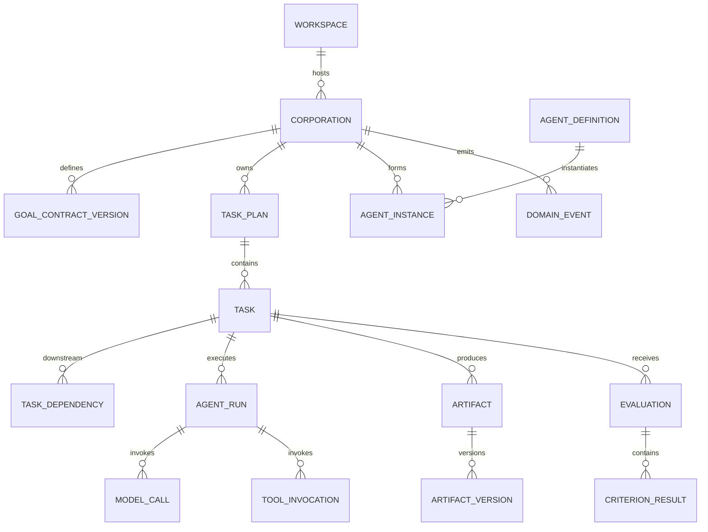

# 数据模型设计

## 1. 目标

本文件把领域模型映射为持久化实体，说明关系、所有权、不可变性和删除策略。具体 DDL 见 [SQLite Schema](SQLite-Schema.md)。

## 2. 聚合

本节中的名称是逻辑实体，不等同于“一实体一张表”。每个逻辑实体必须明确映射到独立表、父表结构化字段、账本/事件投影或受管 Artifact；禁止由实现者临时选择存储位置。

| 聚合 | 逻辑实体 | v0.1 物理映射 |
|---|---|---|
| Workspace | `workspace` | `workspace` 表 |
| Workspace | `workspace_permission` | `workspace.permission_mode`、`access_status`、`last_verified_at` |
| Workspace | `workspace_snapshot` | `workspace.path_identity_json`；只保存平台身份校验的最小元数据 |
| Corporation | `corporation` | `corporation` 表 |
| Corporation | `goal_contract` | 后续迁移增加 `corporation.active_goal_version` 并指向当前版本，不设可变主表 |
| Corporation | `goal_contract_version` | `goal_contract_version` 表，不可变 |
| Corporation | `corporation_policy` | v0.1 使用内置、版本化 Policy Bundle；后续迁移增加 `corporation.policy_version` |
| Corporation | `organization` | 后续迁移增加 `corporation.active_organization_version` 并指向当前版本 |
| Corporation | `organization_version` | `organization_version` 表，不可变 |
| Corporation | 命令幂等回执 | 内部 `corporation_command` 表；Renderer 不可读取 |
| Task | `task_plan` | `task_plan` 表 |
| Task | `task` | `task` 表 |
| Task | `task_dependency` | `task_dependency` 表 |
| Task | `task_input` | `task.contract_json.inputRefs` |
| Task | `task_output_contract` | `task.contract_json.expectedOutputs` |
| Task | `acceptance_criterion` | `task.contract_json.acceptanceCriteria` |
| Task | `task_lease` | `task.lease_owner`、`lease_expires_at` |
| Agent | `agent_definition` | `agent_definition` 表；能力和策略在版本化 `definition_json` |
| Agent | `agent_instance` | `agent_instance` 表 |
| Agent | `agent_capability` | `agent_definition.definition_json.capabilities` |
| Agent | `agent_run` | `agent_run` 表 |
| Agent | `model_call` | `model_call` 表 |
| Agent | `tool_invocation` | `tool_invocation` 表 |
| Artifact | `artifact` | `artifact` 表 |
| Artifact | `artifact_version` | `artifact_version` 表，不可变 |
| Artifact | `artifact_source` | `artifact_source` 表 |
| Artifact | `change_set` | `artifact` 中 `CHANGE_SET` 类型及其当前 `artifact_version` |
| Artifact | `change_set_operation` | Change Set 的版本化内容，按 Artifact Protocol Schema 存储 |
| Evaluation | `evaluation_plan` | `task.contract_json.acceptanceCriteria` 与运行时选择的 evaluator 列表 |
| Evaluation | `evaluation` | `evaluation` 表 |
| Evaluation | `criterion_result` | `evaluation.report_json.criterionResults` |
| Evaluation | `evidence_ref` | `evaluation.report_json.evidenceRefs`，引用 Artifact/Run/Tool 记录 |
| Evaluation | `evaluation_issue` | `evaluation.report_json.issues` |
| Governance | `approval_request` | `approval_request` 表 |
| Governance | `budget_account` | `budget_ledger` 的 Corporation 级投影 |
| Governance | `budget_reservation` | `budget_ledger` 中成对的 `RESERVE`/`RELEASE` 条目 |
| Governance | `budget_ledger` | `budget_ledger` 表，只追加 |
| Governance | `policy_decision` | `domain_event` 中版本化 Policy Decision 事件 |
| Governance | `domain_event` | `domain_event` 表，只追加 |
| Governance | `decision_record` | `DECISION_RECORD` Artifact |
| Governance | `provider` | `provider` 表 |
| Governance | `model_route` | Agent Definition/Instance 的版本化路由引用与运行时调度记录 |
| Governance | `memory_item` | `memory_item` 表 |
| Governance | `capability_outcome` | Evaluation、Agent Run 与用量记录形成的可重建投影 |

Workspace 路径是敏感数据。Renderer 只获得用户主动授权的 `display_path`、Workspace ID、权限和可访问状态；`canonical_root_path` 与 `path_identity_json` 只存在于 Electron Main、Rust Core 和持久化层。

Task 使用稳定 ID；计划修订可创建新 Task 或标记旧 Task 被取代，禁止改变已执行 Task 的历史合同。Agent Definition 可复用，Instance 属于 Corporation，Run 属于 Task。Artifact Version 不可变；文件内容位于 Artifact Store，数据库保存引用和哈希。

## 3. 核心关系



## 4. 状态存储

枚举在应用层验证，SQLite 使用 TEXT + CHECK 约束。原因：

- 可读；
- 迁移简单；
- 不依赖数据库厂商枚举；
- 未知值可在迁移时明确处理。

状态表保存当前值，`domain_event` 保存变化历史。

Corporation 的 create、update-name 与 archive 在同一个 `BEGIN IMMEDIATE` 短事务中提交当前状态、一个同版本 Domain Event 和一个命令回执。`domain_event` 由 SQLite trigger 拒绝更新和删除；未来事件分发游标使用独立投影，不修改事实事件。

## 5. JSON 使用边界

适合 JSON：

- Provider 专属非查询配置；
- 模型用量明细；
- Policy 输入快照；
- 结构化诊断详情；
- Schema 化的小型 Artifact。

不适合 JSON：

- Task 状态；
- 依赖边；
- 常用筛选字段；
- 成本账本；
- 需要外键完整性的关系。

每个 JSON 字段带对应 Schema 版本。

## 6. 删除与保留

### 6.1 软删除

以下实体使用 `archived_at` 或 `retired_at`：

- Corporation；
- Agent Definition；
- Provider 配置；
- Memory Item。

### 6.2 不可删除审计记录

在 Corporation 存在期间不删除：

- Domain Event；
- Budget Ledger；
- Approval；
- Evaluation；
- Tool Invocation；
- Artifact 来源。

### 6.3 用户发起彻底删除

流程：

1. 停止运行；
2. 生成删除预览；
3. 删除内部 Artifact 与数据库记录；
4. 删除密钥引用（如不再使用）；
5. 默认不删除用户工作区文件；
6. vacuum 由维护任务择机执行；
7. 输出删除报告。

## 7. 敏感数据分类

| 数据 | 存储 |
|---|---|
| API Key / Token | OS 安全存储，只存引用 |
| Provider Endpoint | SQLite |
| 完整 Prompt/响应 | 默认不长期保存；调试模式脱敏 |
| 文件绝对路径 | SQLite，可视为敏感 |
| Artifact 内容 | Managed Store / Workspace |
| 费用与 Token | SQLite |
| 审批理由 | SQLite，脱敏 |

## 8. ID、金额与时间

- ID：UUID v7 TEXT；
- 金额：微单位 decimal string 在协议中，SQLite INTEGER（确保范围）；
- Token：INTEGER；
- 时间：UTC ISO-8601 TEXT；
- 排序：时间 + UUID；
- 哈希：小写十六进制 SHA-256。

## 9. 乐观并发

核心可变表包含 `version INTEGER NOT NULL`：

```sql
UPDATE task
SET status = ?, version = version + 1
WHERE id = ? AND version = ?;
```

影响行数为 0 表示并发冲突，调用方重新加载。

## 10. 索引策略

关键查询：

- Corporation 列表和状态；
- Ready Task；
- Task 依赖；
- Run/Tool/Model 调用时间线；
- Artifact 当前版本；
- 待审批；
- 未投递事件；
- Budget 余额；
- Memory FTS。

索引以真实查询验证，避免为所有字段盲目建索引。

## 11. 迁移原则

- 迁移顺序单调；
- 应用启动前备份；
- 每次迁移在事务中执行（SQLite 支持范围内）；
- 大表重建使用新表复制切换；
- 不允许应用自动降级数据库；
- 新版本首次打开后记录 schema version；
- 迁移测试覆盖从所有已发布版本升级。

## 12. v0.1 模块验收断言

- 所有核心实体有明确所有权；
- 外键、唯一性和状态约束落地；
- 账本与事件不可被普通业务更新；
- 密钥不进入数据库；
- 数据删除、备份和迁移行为有测试。
