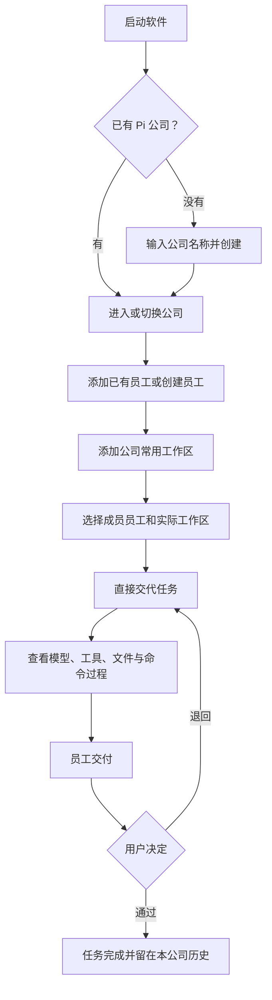
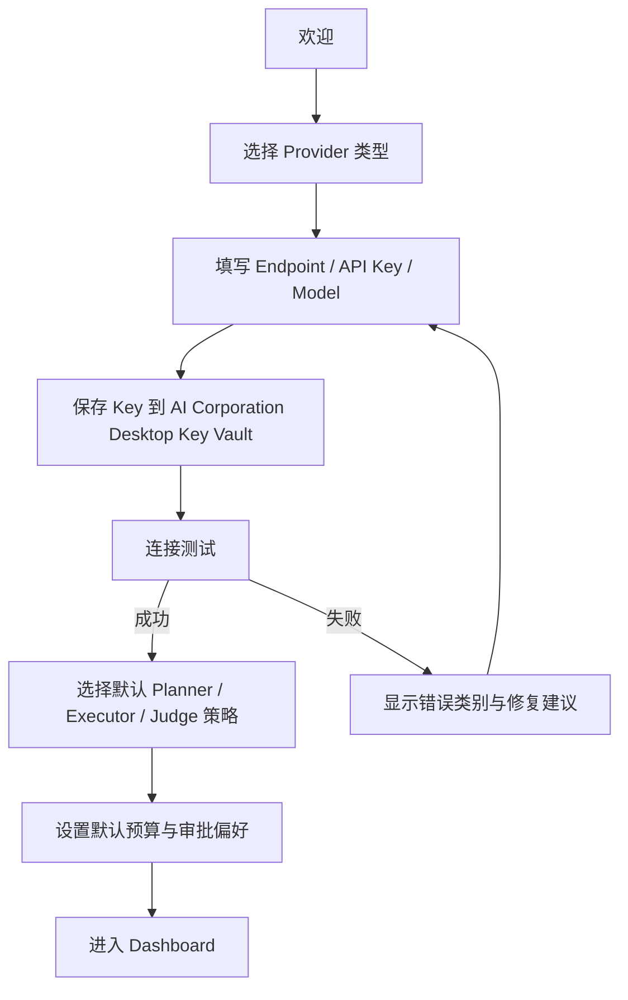
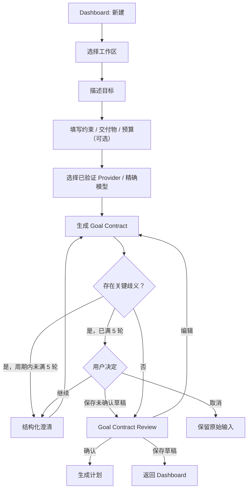
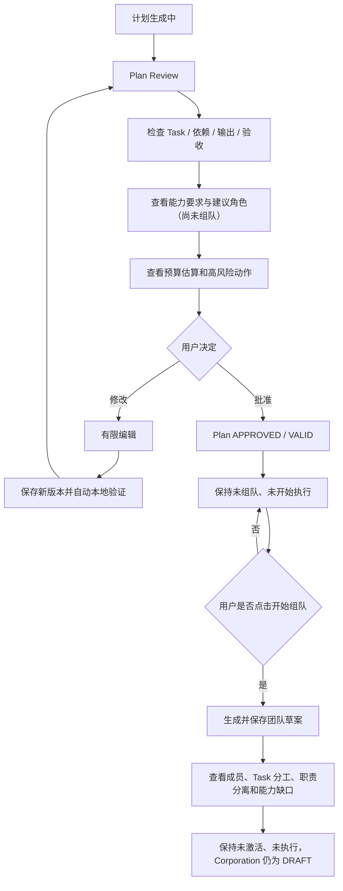
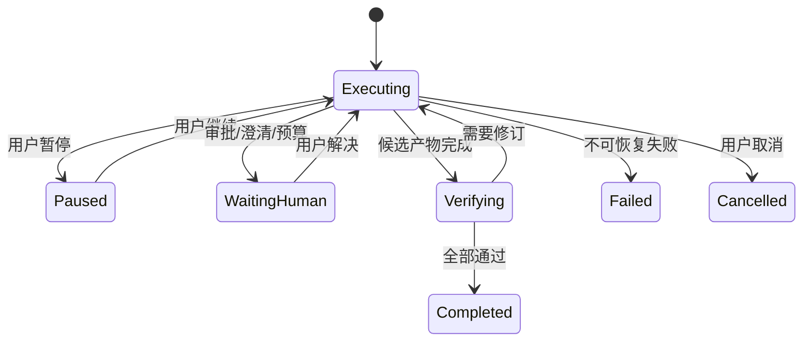
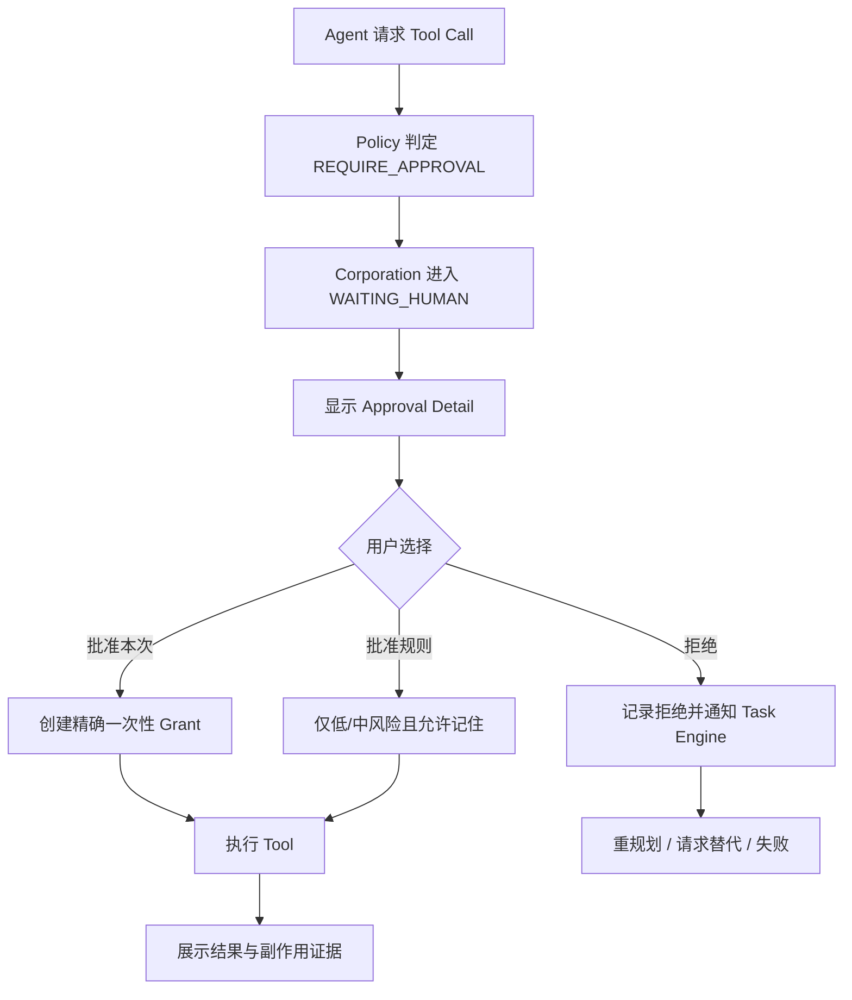
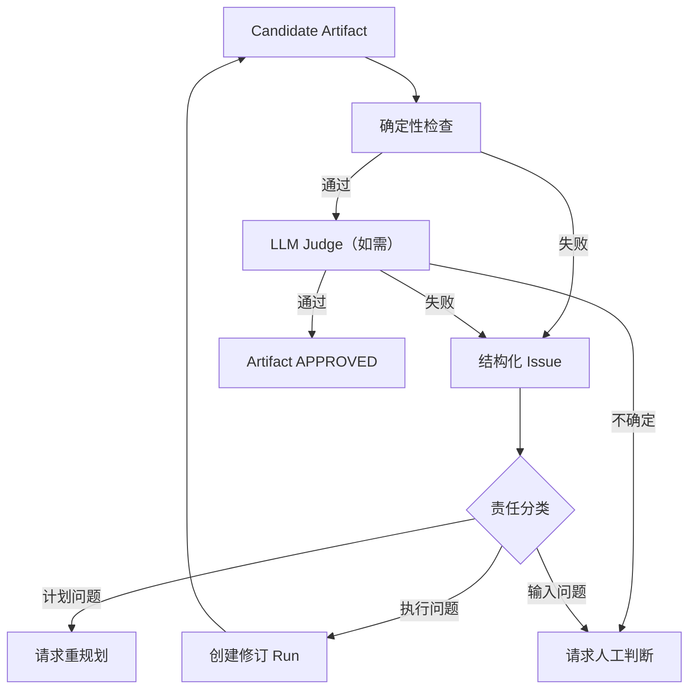
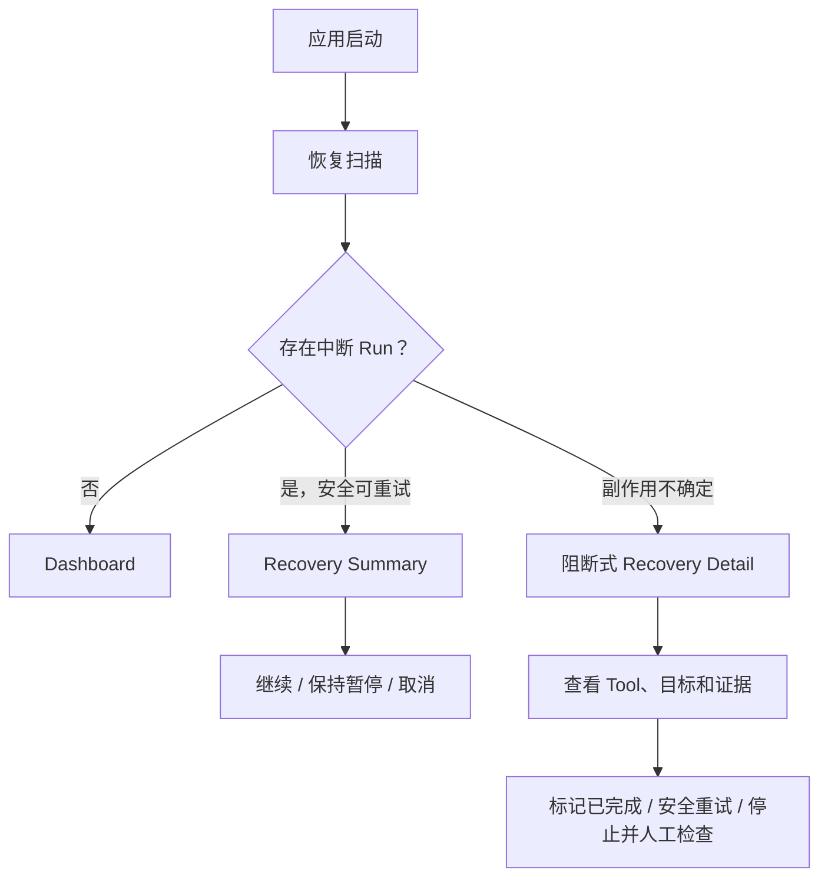
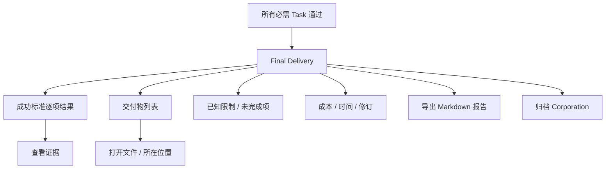

# AI Corporation Desktop v0.1 核心用户流程

> **Pi 重启说明（2026-08-14）**：本文件的旧 Goal、Plan 和固定团队流程不再是新产品入口。重启后的第一个主流程是“创建员工 → 选择该员工自己的模型和技能 → 直接交代任务 → 实时查看模型与工具过程 → 人工验收”。旧流程仅供识别可复用页面和历史数据，不得继续作为新任务的默认实现要求。

## 0. Flow 00：轻量公司与 Pi 员工任务



规则：

- 创建公司只填写名称，不生成 Goal、Plan、预算或固定团队；
- 员工的模型和多项 Skill 配置全局保存，同一员工可加入多家公司；
- 工作区授权全局保存，公司只记录常用关系；移出公司不会删除工作区或用户文件；
- 每项任务只属于一家公司，跨公司不能看到、继续或验收该任务；
- 员工交付时先显示真实成果区：受控写入自动登记，命令产物只有经登记工具核实后才进入；
- 成果区先显示员工总结、文件和检查结果，完整模型与工具过程默认折叠；
- 失败、取消或中断时保留已登记文件，但明确标为“未完成成果”；
- 用户可以在软件内预览文本/代码，并明确点击后打开安全文件或查看所在位置；
- 升级已有 Pi 数据时自动建立“我的公司”，迁移不调用模型、工具或命令；
- 旧 Goal/Plan 数据原表保留，但当前界面不提供入口。

### 0.1 多 Skill 与按需启用

```text
选择本地 Skill 文件夹
→ 文件夹有效：确认卡自动进入当前视口并获得焦点
→ 用户确认后，技能列表和新员工技能选择立即更新
→ 文件夹无效：原因直接显示在导入按钮附近并获得焦点
→ 创建或编辑员工
→ 勾选一项或多项已导入 Skill
→ 直接输入任务，不要求用户再选 Skill
→ 过程区先显示“可用技能”，只含名称和用途
→ 员工自动启用匹配 Skill
→ 展开显示完整说明和按需读取/复制的资源过程
→ 未匹配 Skill 保持未启用
```

规则：

- 员工没有选择 Skill 时不能保存，界面直接说明需要至少选择一项；
- 本地 Skill 文件夹名必须与 `SKILL.md` 的正式名称一致；不一致时在导入按钮附近直接说明失败，不能把原因放在整页底部；
- 文件夹选择完成后，二次确认卡必须自动进入当前视口并获得焦点；确认成功后技能卡和新员工技能选择立即更新，不能依赖用户刷新页面；
- 已失效 Skill 与正常 Skill 分开显示，不能静默换成同类 Skill；
- Skill 启用、资源列表、参考资料读取和资源复制都使用普通工具过程卡，显示名称、相对路径、状态和错误；
- 模型与界面都不显示应用自管 Skill 副本的绝对路径；
- `scripts/` 显示当前平台是否支持以及缺少的环境；文件存在不能直接冒充可运行；
- 用户不需要批准只读启用、列出和读取；复制资源沿用当前任务 Workspace 写入规则。

### 0.2 Skill 脚本与环境准备

```text
员工启用匹配 Skill 并请求运行脚本
→ 软件检查脚本类型、运行程序和依赖
→ 已就绪：进入本任务脚本授权
→ 有缺失：展示独立环境安装计划
→ 用户选择“自动安装”或“暂不安装”
→ 如需系统程序，再展示 winget/Homebrew 二次确认
→ 安装后复检
→ 复检通过后继续运行脚本
→ 显示输出、结果并核对真实成果
```

规则：

- 检查本身不弹批准；独立环境安装、系统安装和脚本执行分别批准，前一个批准不能代替后一个；
- 安装卡显示缺什么、为什么需要、包来源、是否联网、安装到 Skill 或项目环境、精确命令、包安装脚本风险和系统影响；
- 默认按钮为“自动安装”，次按钮为“暂不安装”；系统安装使用“允许系统安装”，不能显示永久允许；
- Python 私有运行程序明确写“由 AI Corporation 管理，不修改系统 Python/PATH”；项目环境明确写入当前 Workspace；
- 管理器缺失、用户跳过、失败、取消、超时或复检失败时，准确说明任务没有继续运行脚本以及解决办法；
- 过程按“检查 → 计划 → 批准 → 安装 → 复检 → 脚本”顺序展示，stdout/stderr、退出码、耗时和截断可展开；
- 界面只显示 Skill 名称、相对脚本路径和“应用自管环境”等逻辑位置，不显示应用内部绝对路径；
- 任务取消、应用退出或状态变化后，旧批准按钮立即失效；重启不自动重放安装或脚本。

## 1. Flow 01：首次设置

### 目标

让用户在不暴露密钥的前提下完成一个可用 Provider 配置。



### 关键交互

- API Key 在专用密码输入框录入，默认遮挡，只能由用户主动短暂显示；
- 提交期间禁用重复提交；重新打开页面默认显示遮挡值，用户主动选择“查看”后可以显示已存 Key 明文；
- 保存前说明存储位置；
- 连接测试显示步骤，不输出 Authorization；
- 连接测试固定 15 秒超时，测试期间可取消；超过 10 秒显示安全诊断提示，不显示原始 Provider 正文；
- Provider 返回并验证模型列表后只能精确选择其中一个模型；不允许手工模型 ID，也不自动回退到其他模型；
- 模型选择后可执行一次固定、无用户资料、最多 32 output tokens 的非流式测试生成；显示受限输出、stop reason 和 Provider 返回的 token usage；无可靠价格时明确显示费用未知；
- 生成超时默认 60 秒，可在 5–300 秒内配置，测试生成始终可取消；
- 用户可跳过非必需个性化，但不能跳过至少一个可用 Provider。

### 异常

- 应用 Key Vault 数据库或本地加密密钥不可用：阻断保存，说明未保存/未修改，并提供重试或重新录入路径，不能降级明文；
- 网络不可用：允许保存未验证配置，但 Dashboard 显示“需验证”，不能启动 Corporation；
- 认证失败：不盲目重试；
- Endpoint 格式错误：字段级提示。
- 远程 Endpoint 只允许 HTTPS；HTTP 仅用于本机 loopback；不允许 redirect、URL 凭据、query 或 fragment；
- Endpoint 或 Key 变化后显示“未验证”，成功/失败结果与模型列表在重启后恢复；该结果不冒充运行时健康或熔断状态。
- Endpoint 或 Key 变化同时清除模型选择与生成测试结果；模型或超时变化清除旧生成测试结果但不破坏连接验证；名称或启停变化保留结果。任何变化都不静默切换模型。生成取消保留此前结果，重启不自动重发。

## 2. Flow 02：创建 Corporation 与 Goal Contract



### 表单结构

1. 目标（必填，大文本）；
2. 工作区（必填，显示读写权限）；
3. 期望交付物（可选，推荐）；
4. 约束（可选）；
5. 非目标（高级）；
6. 预算（使用默认值，可展开）。

模型生成只要求目标、Corporation 名称和可用 Workspace；成功标准、交付物、约束与非目标是可选提示。分析前必须明确显示接收这些字段的 Provider 和精确模型。Workspace 路径、目录结构和文件内容不发送给 Provider。

### Goal Contract Review

必须逐块显示：

- 目标摘要；
- 成功标准；
- 范围内；
- 范围外；
- 假设；
- 交付物；
- 风险；
- 预算和停止条件。

高影响假设使用待确认标记，不能放在折叠区。

每个澄清周期最多 5 轮。达到上限时 UI 停止显示“生成中”，准确展示当前轮次、累计 usage、剩余 HIGH-impact 缺口，并提供“继续下一 5 轮”“保存为未确认草稿”“取消”三个动作。续期只对本次周期生效；不能记住为自动偏好。保存草稿后仍须逐项确认 HIGH 假设，不能直接批准或规划。

## 3. Flow 03：计划审阅与批准



### 计划编辑边界

v0.1 支持：

- 修改 Task 标题、目标、说明、优先级；
- 新增、修改和删除验收标准；
- 调整明确依赖；
- 删除未执行 Task；普通依赖和里程碑引用自动清理，输出仍被使用时阻止删除并列出受影响 Task；
- 每次保存产生新的 Plan/Task 身份和只读历史版本；无效版本可以继续修改；
- 仅批准通过验证的 Plan；批准后冻结。

不支持新增 Task、修改预算、Provider 重新规划、任意画布拖拽或修改已批准 Plan。批准不创建团队、不开始执行，也不改变 Corporation 状态。

已批准 Plan 提供“开始组队”。只有用户明确点击后才生成团队草案；草案生成不调用模型，只使用内置 Planner、Executor、Judge 模板和固定分配规则。草案仅展示模型策略，不选择精确 Provider 或模型；保存草案后仍不激活团队、不开始执行，Corporation 保持 `DRAFT`。

团队草案就绪且没有阻断能力缺口时，用户可进入“配置并确认团队”：分别为 Planner、全部 Executor、Judge 从当前已启用且连接验证有效的 Provider 模型列表选择精确模型。三组可以相同或不同，选择不会修改 Provider 设置的默认模型。存在可降级缺口时必须明确勾选接受；存在阻断缺口时不提供激活。确认成功只激活当前团队并创建 Agent 成员，Corporation 仍为 `DRAFT`，界面显示“团队已激活，等待开始执行”；不会调用模型、创建 Run 或开始 Task。

团队激活后提供“开始执行”。只有用户明确点击，应用才重新核对当前公司、工作区、批准计划、团队、成员、任务分工和模型配置，并一次性计算全部任务的 `READY/BLOCKED` 状态。普通首任务创建一个 `CREATED` Run 后立即调用团队激活时锁定的模型；历史 `CREATED` Run 不自动调用，显示“继续执行”。成功结果显示为“尚未成为正式交付物”的候选内容；任务声明工具时，本阶段仍只生成候选内容，界面持续说明工具尚未执行且不会读写文件。人工首任务进入“等待你的决定”且不创建 Run。本次启动最多认领一个任务，Provider 失败不自动重试。

## 4. Flow 04：观察与控制执行



### Workspace 默认信息

- 当前 Task 和 Owner；
- 下一 Task；
- 关键路径；
- 进度和预算；
- 最新 Artifact；
- 待审批；
- 最近重要事件。

### 暂停

- 点击后立即停止调度新 Task；
- 当前步骤进入安全检查点；
- UI 显示“正在暂停”中间态；
- 完成后显示已暂停原因和可恢复位置。

### 取消

危险操作。确认界面说明：

- 将停止哪些 Run；
- 已提交 Artifact 是否保留；
- 用户工作区文件不会自动回滚；
- 是否生成当前进展报告。

## 5. Flow 05：工具审批



### 审批内容

固定顺序：

1. 动作；
2. 请求者和所属 Task；
3. 精确资源；
4. Diff/命令参数；
5. 风险等级；
6. 预计副作用；
7. 数据是否离开本机；
8. 批准范围；
9. 拒绝后的影响。

### 按钮

- 主按钮：`批准本次写入` / `允许本任务运行命令` / `批准这条高风险命令`；
- 次按钮：`拒绝`；
- 可记住时：独立复选框或菜单，不作为默认；
- 删除、不可逆命令、越界访问不得显示“始终允许”。

Pi 编码任务第一次准备运行完整命令时，审批卡必须直接写明：命令会使用用户当前的系统账户运行，项目脚本可能访问所选工作区外的文件，当前版本没有 OS 级强隔离。批准范围只到当前任务结束；之后普通查看、检查、测试和构建命令不再逐条询问。依赖安装、删除、Git 写操作、发布和其他明显高风险命令仍展示完整命令及影响并单独确认。

## 6. Flow 06：验收失败与修订



### UI 表现

- 不用红色总分替代具体问题；
- 按 REQUIRED / IMPORTANT / OPTIONAL 分组；
- 每个问题显示证据和建议动作；
- 显示 `修订 1 / 2`；
- 新旧 Artifact 版本可比较；
- 达到修订上限时给出人工选项，不无限重试。

## 7. Flow 07：崩溃恢复



恢复界面必须避免默认自动重放写入或命令。

## 8. Flow 08：最终交付



完成页不能只显示庆祝动画。若存在未满足项，状态必须是部分完成或失败，而不是 COMPLETED。

## 9. Flow 09：Provider 故障

```text
调用失败
→ 归一化错误
→ 可重试：显示等待和下一次时间
→ Provider 熔断：显示降级
→ 有合规回退：展示已切换模型
→ 无回退：WAITING_HUMAN
→ 用户修改 Provider / 重试 / 保持暂停
```

错误详情只显示安全字段。
