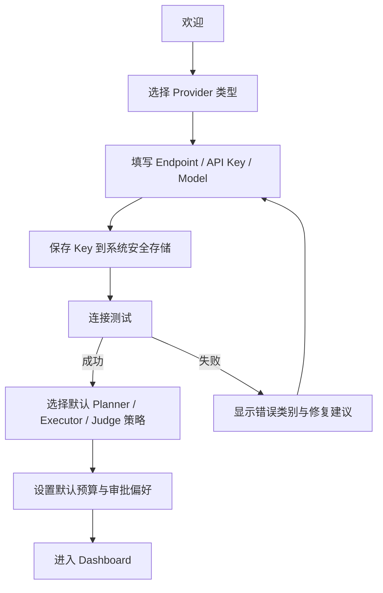
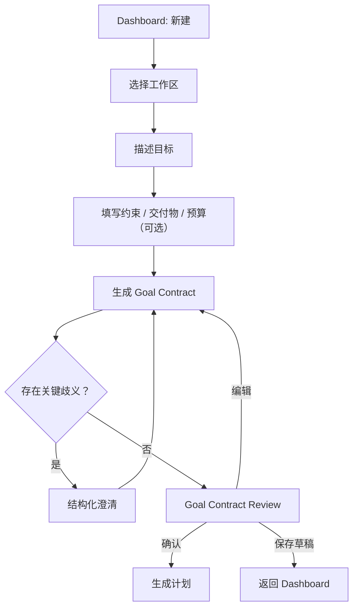
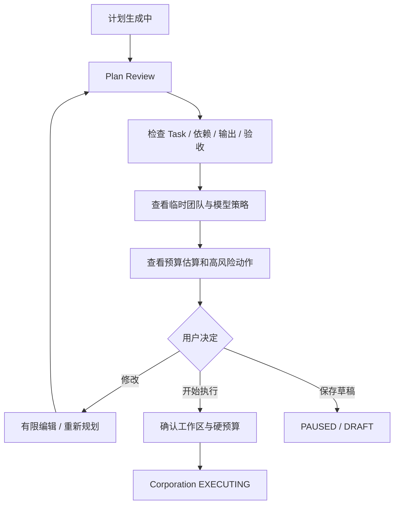
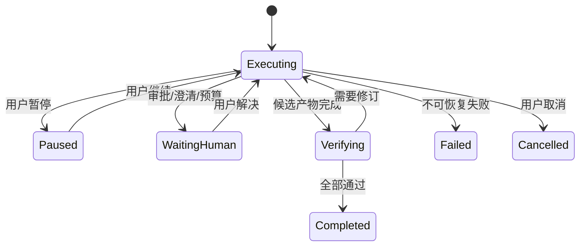
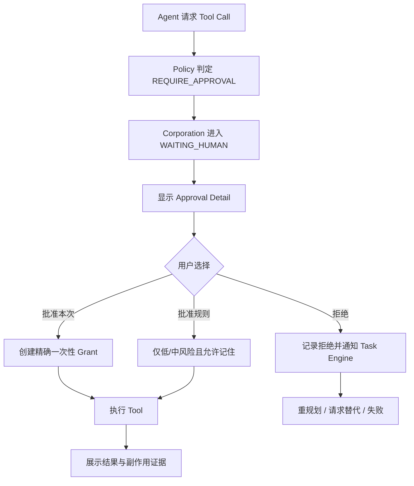
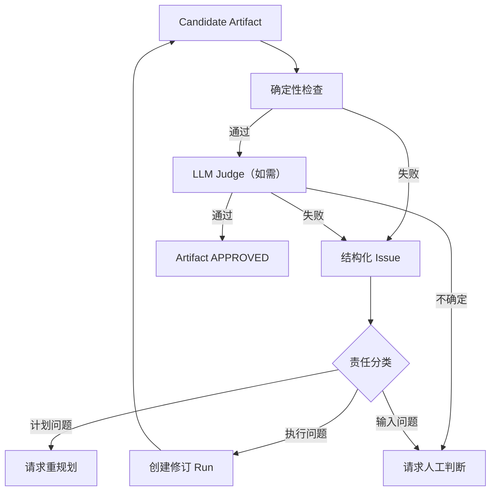
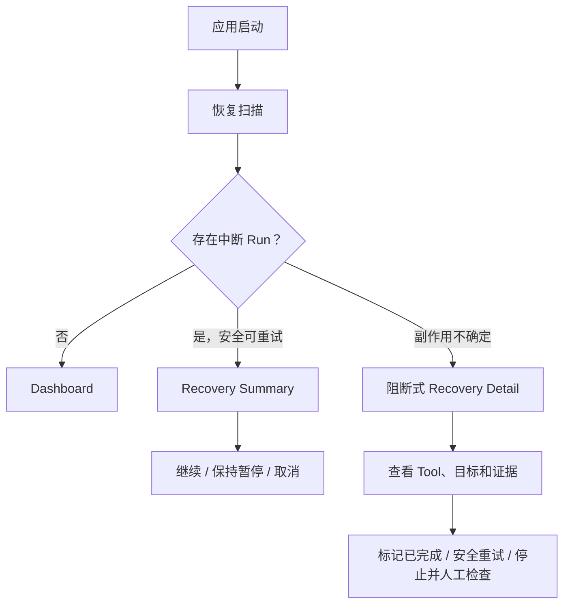
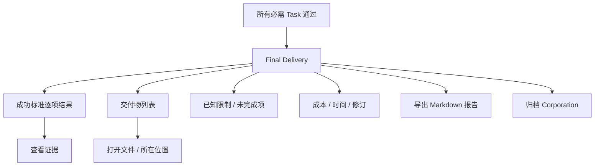

# AI Corporation Desktop v0.1 核心用户流程

## 1. Flow 01：首次设置

### 目标

让用户在不暴露密钥的前提下完成一个可用 Provider 配置。



### 关键交互

- API Key 默认遮挡，只能短暂显示；
- 保存前说明存储位置；
- 连接测试显示步骤，不输出 Authorization；
- Provider 返回模型列表时可选择；失败时允许手工模型 ID；
- 用户可跳过非必需个性化，但不能跳过至少一个可用 Provider。

### 异常

- 系统安全存储不可用：阻断保存，不能降级明文；
- 网络不可用：允许保存未验证配置，但 Dashboard 显示“需验证”，不能启动 Corporation；
- 认证失败：不盲目重试；
- Endpoint 格式错误：字段级提示。

## 2. Flow 02：创建 Corporation 与 Goal Contract



### 表单结构

1. 目标（必填，大文本）；
2. 工作区（必填，显示读写权限）；
3. 期望交付物（可选，推荐）；
4. 约束（可选）；
5. 非目标（高级）；
6. 预算（使用默认值，可展开）。

### Goal Contract Review

必须逐块显示：

- 目标摘要；
- 成功标准；
- 范围内；
- 范围外；
- 假设；
- 交付物；
- 风险；
- 预算和停止条件。

高影响假设使用待确认标记，不能放在折叠区。

## 3. Flow 03：计划审阅与开始执行



### 计划编辑边界

v0.1 支持：

- 修改 Task 标题、说明、优先级；
- 修改验收标准；
- 调整明确依赖；
- 删除未执行 Task；
- 请求重新规划。

不支持任意画布拖拽或在执行中直接改写已完成 Task。

## 4. Flow 04：观察与控制执行



### Workspace 默认信息

- 当前 Task 和 Owner；
- 下一 Task；
- 关键路径；
- 进度和预算；
- 最新 Artifact；
- 待审批；
- 最近重要事件。

### 暂停

- 点击后立即停止调度新 Task；
- 当前步骤进入安全检查点；
- UI 显示“正在暂停”中间态；
- 完成后显示已暂停原因和可恢复位置。

### 取消

危险操作。确认界面说明：

- 将停止哪些 Run；
- 已提交 Artifact 是否保留；
- 用户工作区文件不会自动回滚；
- 是否生成当前进展报告。

## 5. Flow 05：工具审批



### 审批内容

固定顺序：

1. 动作；
2. 请求者和所属 Task；
3. 精确资源；
4. Diff/命令参数；
5. 风险等级；
6. 预计副作用；
7. 数据是否离开本机；
8. 批准范围；
9. 拒绝后的影响。

### 按钮

- 主按钮：`批准本次写入` / `批准本次命令`；
- 次按钮：`拒绝`；
- 可记住时：独立复选框或菜单，不作为默认；
- 删除、不可逆命令、越界访问不得显示“始终允许”。

## 6. Flow 06：验收失败与修订



### UI 表现

- 不用红色总分替代具体问题；
- 按 REQUIRED / IMPORTANT / OPTIONAL 分组；
- 每个问题显示证据和建议动作；
- 显示 `修订 1 / 2`；
- 新旧 Artifact 版本可比较；
- 达到修订上限时给出人工选项，不无限重试。

## 7. Flow 07：崩溃恢复



恢复界面必须避免默认自动重放写入或命令。

## 8. Flow 08：最终交付



完成页不能只显示庆祝动画。若存在未满足项，状态必须是部分完成或失败，而不是 COMPLETED。

## 9. Flow 09：Provider 故障

```text
调用失败
→ 归一化错误
→ 可重试：显示等待和下一次时间
→ Provider 熔断：显示降级
→ 有合规回退：展示已切换模型
→ 无回退：WAITING_HUMAN
→ 用户修改 Provider / 重试 / 保持暂停
```

错误详情只显示安全字段。

