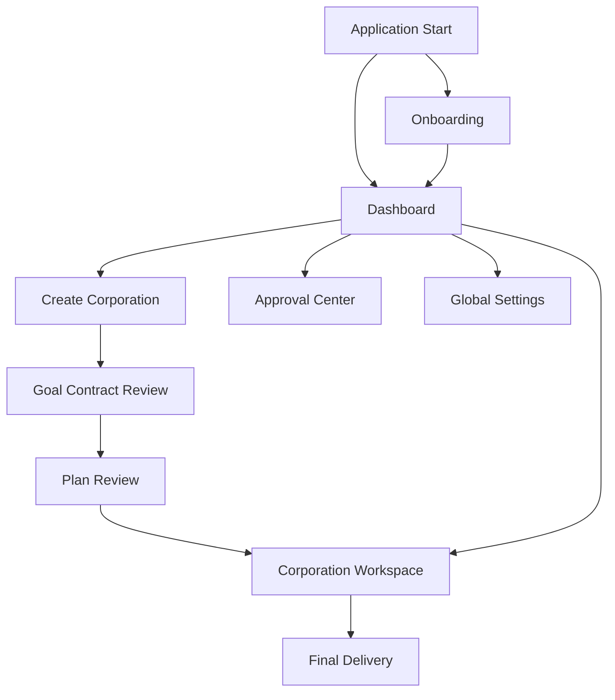

# AI Corporation Desktop v0.1 信息架构

## 1. 目标

信息架构以“发现状态—处理阻塞—检查证据—获得交付”为主线，减少用户在 Agent、Task 和日志之间反复寻找关键事实。

## 2. 站点地图



## 3. 全局层级

### 3.1 Dashboard

内容：

- 继续当前 Corporation；
- 待审批；
- 最近 Corporation；
- 创建 Corporation；
- Provider/环境异常；
- 可恢复任务。

优先级：

1. 阻塞用户决定；
2. 可恢复的中断；
3. 活跃执行；
4. 最近完成；
5. 创建新任务。

### 3.2 Approval Center

聚合所有 Corporation 的待审批项。默认按：

1. 风险；
2. 阻塞关键路径程度；
3. 请求时间。

列表只提供摘要；批准动作必须进入详情，不提供批量批准。

### 3.3 Global Settings

```text
Settings
├── Providers
├── Models & Routing
├── Security & Approvals
├── Data & Privacy
├── Appearance
└── About & Diagnostics
```

设置变更影响后续动作。可能影响活跃运行时必须展示影响范围。

## 4. Corporation Workspace

### 4.1 Overview

默认落点，回答：

- Goal；
- 当前状态；
- 阻塞；
- 当前 Task；
- 进度与预算；
- 最近 Artifact；
- 下一步。

### 4.2 Plan

规划前：

- Goal Contract；
- 未解决问题；
- 生成计划。

规划后：

- Task 列表/依赖；
- 每个 Task 的输出与验收；
- 关键路径；
- 计划版本；
- 开始执行。

v0.1 默认列表 + 依赖摘要，不做通用画布。

### 4.3 Team

展示责任而非人格：

- Role；
- 当前责任 Task；
- Capability；
- Model Route；
- Tools；
- Effective Policy；
- 运行状态。

### 4.4 Artifacts

按：

- Final Deliverables；
- Approved；
- Candidate；
- Rejected/Superseded；

分组。支持类型、Task、状态筛选。

### 4.5 Timeline

用户时间线与技术事件分层：

- 默认：重要业务事件；
- 展开：模型调用、工具调用、Policy 和评价；
- 诊断模式：脱敏技术详情。

### 4.6 Corporation Settings

- Goal Contract 版本；
- 工作区；
- 预算；
- 模型策略；
- 审批策略；
- 归档/取消。

危险设置放底部独立区域。

## 5. 详情层

| 对象 | 默认容器 | 主要内容 |
|---|---|---|
| Task | 右侧抽屉 | 合同、依赖、Owner、状态、输入输出、验收 |
| Agent | 右侧抽屉 | Role、能力、模型、工具、当前 Run |
| Artifact | 专用详情页 | 内容、版本、来源、评价、Diff |
| Evaluation | 右侧抽屉/Artifact 子页 | 逐标准结论、证据、问题 |
| Tool Invocation | 安全详情抽屉 | 输入摘要、Policy、结果、副作用 |
| Model Call | 诊断抽屉 | Provider、模型、用量、错误；不显示隐藏推理 |
| Approval | 专用阻断页/模态 | 精确动作、风险、资源、批准范围 |

## 6. URL/路由建议

Electron 内部路由：

```text
/
/onboarding
/corporations
/corporations/new
/corporations/:corporationId/overview
/corporations/:corporationId/plan
/corporations/:corporationId/team
/corporations/:corporationId/artifacts
/corporations/:corporationId/artifacts/:artifactId
/corporations/:corporationId/timeline
/corporations/:corporationId/settings
/approvals
/approvals/:approvalId
/settings/providers
/settings/models
/settings/security
/settings/data
/settings/appearance
/settings/about
```

路由中不包含密钥、绝对文件路径或完整用户目标。

## 7. 数据到 UI 映射

| 领域实体 | UI 主位置 |
|---|---|
| Corporation | Dashboard 卡片、Workspace Header |
| Goal Contract | Create/Review、Overview |
| Task | Plan、Overview 当前任务 |
| Agent Instance | Team |
| Agent Run | Task 详情、Timeline |
| Artifact | Artifacts、Delivery |
| Evaluation | Artifact 详情、Task 详情 |
| Approval Request | Approval Center、Workspace 阻断卡片 |
| Domain Event | Timeline |
| Budget Ledger | Header 预算、诊断详情 |

## 8. 搜索与筛选

v0.1：

- Dashboard：按名称/目标搜索；
- Task：按状态、Owner；
- Artifact：按名称、类型、状态；
- Timeline：按事件类别、Task、Agent；
- Approval：按风险、Corporation。

不实现全局语义搜索。

## 9. 空间与持久化

- 记住上次打开的 Corporation 和内部 Tab；
- 重启后若存在恢复风险，优先进入 Recovery，而不是直接恢复旧页面；
- 侧栏收起状态可本地保存；
- 筛选条件在同一 Corporation 内保留；
- 不持久化审批模态的临时输入。

